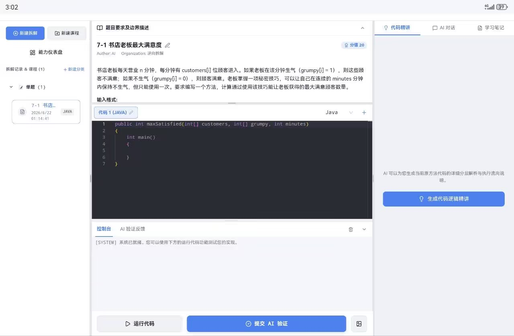
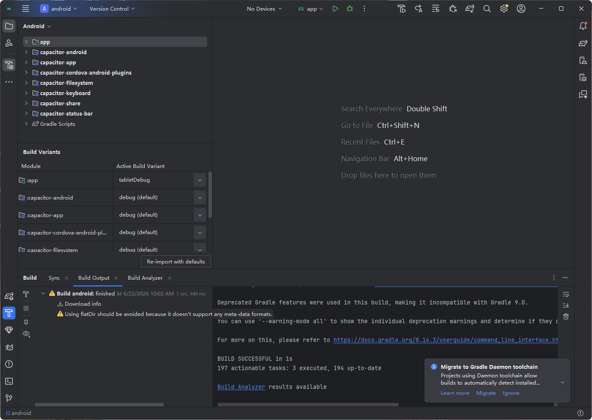
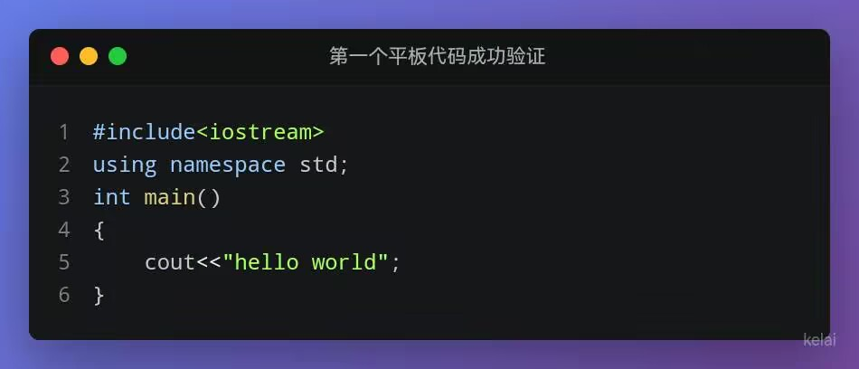

## 问题

之前错误的叫法说成“上面被挡住了”这种语言AI容易产生误解，也不是问题的核心，当我在提示词把这句话改成了“状态栏挡住了程序”的时候，AI 的计划瞬间就变得比较清晰了
计划：
[状态栏遮挡计划（Gemini）](/ke-she/02-代码学习工具-supplement/引用文件/gemini日志/状态栏遮挡-计划/)
这是最终的工作日志
[状态栏遮挡工作日志（Gemini）](/ke-she/02-代码学习工具-supplement/引用文件/gemini日志/状态栏遮挡-工作日志/)

## 修复bug3
计划
[bugfix-round-3-任务](/ke-she/02-代码学习工具-supplement/引用文件/bugfix-round-3-任务/)
打包构建过程当中的问题，以及解决思路
[gradle同步指南（Gemini）](/ke-she/02-代码学习工具-supplement/引用文件/gemini日志/gradle同步指南/)

AI工作日志
[bugfix3工作日志（Gemini）](/ke-she/02-代码学习工具-supplement/引用文件/gemini日志/bugfix3-工作日志/)



## 平板


## 分发错误
安装包不全面
```
有一个问题，安装包我分享给朋友，对方不能连接，好像后端没有做好啊"E:\AI\antigravity\stady-code\final\Supplement_Installer_x64.msi"
```
测评报告：
[后端连接问题分析报告](/ke-she/02-代码学习工具-supplement/引用文件/后端连接问题分析报告/)

## 通过项目源码重新构建的方式重新生成zip文件，比安装成功概率要高