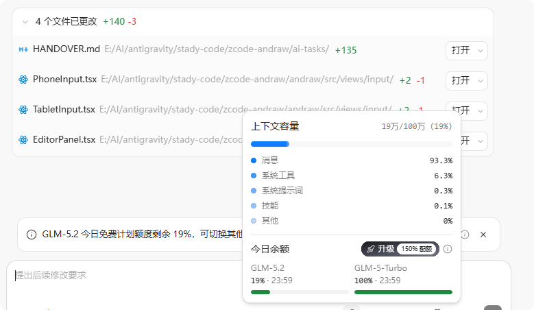

## 页面摘要
- **核心定位**：AI 辅助编码工具与大语言模型运行机制的实战记录。
- **重点成果**：分析了在超大型项目开发中，当上下文突破 10 万时 Token 的消耗特点与推理速度。

---

## 正文整理
> 原始标题：创建工具

智谱 5.2 模型，使用官方 ZCode 代码 vibe coding 工具。

### 模型消耗问题
尽管免费送的额度有 300 万 Token，但在超大的项目面前，或者在上下文突破 10 万的项目当中，Token 消耗得非常快。普遍的情况是，上下文窗口大小约为 5 万～8 万。

*图：ZCode 代码协作工具中的 Token 消耗指标统计*

实测在 20 万的上下文窗口中，240 万 Token 只生成了 140 行的计划。当然，这个数据并不能定量地衡量大模型的功能，花费的 Token 和最终生成的代码之间是没有关系的，只不过这个悬殊确实是存在的，尤其是在上下文容量非常高的情况下。

## 相关资料
- **附件与链接索引**：见 [链接整理/链接索引.md](/ke-she/assets/链接索引/)
- **原始备份**：见 [原始备份_课设内容大分级/创建工具.md](/ke-she/02-代码学习工具-supplement/原始备份_课设内容大分级/创建工具/)