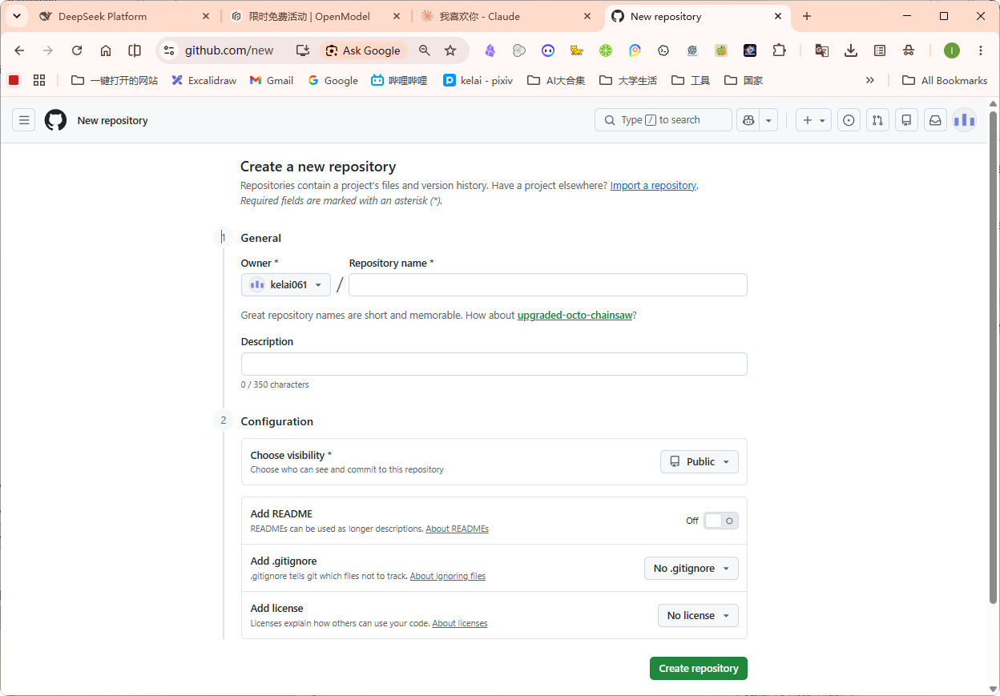
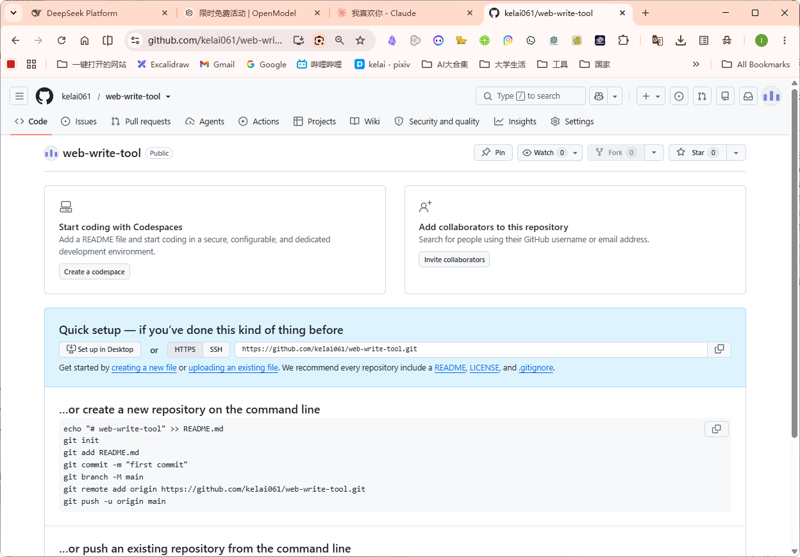
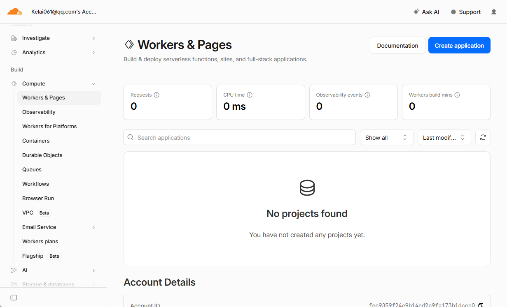
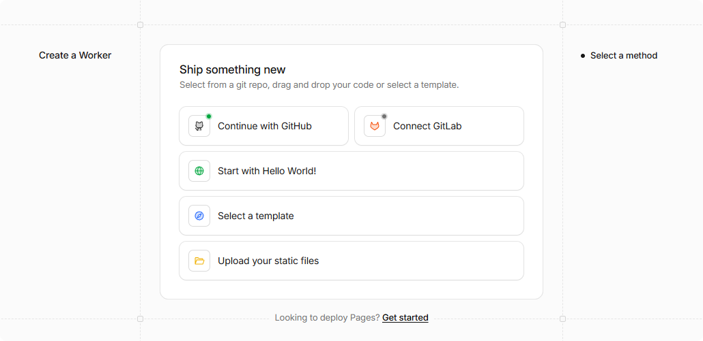
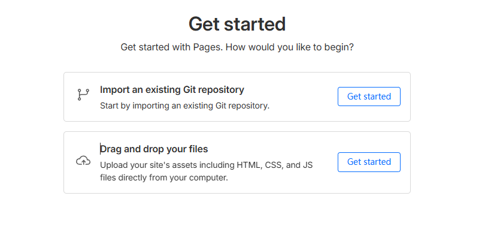
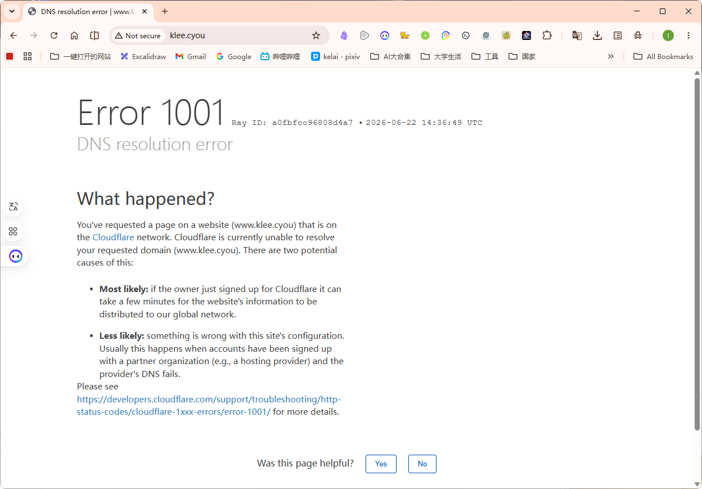

## 
首先登陆网站

1. 打开浏览器并访问：**[https://github.com/new](https://github.com/new)** （如果还没登录 GitHub，请先登录）。
2. 在 **Repository name** 输入框中，起一个名字，例如：`web-imitation-tool`。
3. 确保选择 **Public**（公开）。
4. **注意**：下面的 “Add a README file”、“Add .gitignore”、“Choose a license” **都不要勾选**（保持默认未勾选状态即可）。
5. 点击最下方的绿色按钮 **Create repository**。
6. 创建成功后，您会看到一个页面，上面有一个以 `.git` 结尾的链接，类似这样： `https://github.com/您的用户名/web-imitation-tool.git`
   
## 第二步 

由于您本地的命令行是完全交互式的，可以直接响应弹窗或输入。请在您的电脑上打开终端（PowerShell 或 CMD），定位到项目目录并运行以下命令：
```powershell
cd "E:\AI\zcode\object\Web imitation\tool"

git push -u origin main
```
在您的终端里完成 GitHub 的授权登录，待推送成功后，在我们的聊天框回复我 **“已推送”**，我就可以继续为您配置 Cloudflare Pages 部署！

登陆完成后就可以了

## 步骤3
代码已成功更新，并推送到您的 GitHub 仓库：[https://github.com/kelai061/web-write-tool](https://github.com/kelai061/web-write-tool)。

TIP

我已经自动帮您把 `astro.config.mjs` 中的 `site` 域名配置更新为了 `https://web-write-tool.pages.dev`，这样等部署完成后，您网站的 Sitemap 和搜索引擎优化（SEO）就会自动匹配正确的域名。

现在，您只需要登录 Cloudflare 控制台完成最后的部署：

1. **登录 Cloudflare**： 打开浏览器，访问 [https://dash.cloudflare.com](https://dash.cloudflare.com/)，登录或注册您的账号（推荐直接使用 **GitHub 一键登录**）。
    
2. **创建 Pages 应用**：
    
    - 登录后，在左侧导航栏中点击 **Workers & Pages**。
    - 点击右侧的 **Create application** (创建应用程序) 按钮。
    - 切换到 **Pages** 选项卡。
    - 点击 **Connect to Git** (连接到 Git) 按钮。
    - 
3. **选择并关联仓库**：
    
    - 如果是第一次使用，系统会提示您授权 Cloudflare 访问您的 GitHub 账号。
    - 授权后，在列表中选中您的仓库 `web-write-tool`，然后点击 **Begin setup** (开始设置)。
4. **配置构建参数**： 在配置页面中，请确保按照以下参数填写（大部分 Cloudflare 会自动识别，但建议核对）：
    
    - **Project name** (项目名称): `web-write-tool` (这会决定您的默认二级域名)
    - **Production branch** (生产分支): `main`
    - **Framework preset** (框架预设): 选择 **Astro**
    - **Build command** (构建命令): `npm run build`
    - **Build output directory** (构建输出目录): `dist`
    
    **添加环境变量**：
    
    - 展开页面下方的 **Environment variables (advanced)** (环境变量 - 高级) 区块。
    - 点击 **Add variable**。
    - **Variable name** (变量名称) 填：`NODE_VERSION`
    - **Value** (值) 填：`24`
5. **部署与上线**：
    
    - 点击最下方的 **Save and Deploy** (保存并部署)。
    - 等待 1~2 分钟，Cloudflare 会自动完成拉取、安装依赖和构建。
    - 构建完成后，您就可以通过 **`https://web-write-tool.pages.dev`** 访问您的专属写作文档站了！
6. **（可选）自定义域名**： 如果您有自己的域名，可以在 Pages 项目的 **Custom domains** 页面中点击 **Set up a custom domain**，输入您的域名，Cloudflare 会自动帮您配置好解析和 SSL 证书。

## 问题：
Build output directory (构建输出目录): dist
Production branch (生产分支): main
Framework preset (框架预设): 选择 Astro
这些没有喵

原来是这里没有看到这里不是静态页面
跳转到这个界面

**Import an existing Git repository** (导入现有的 Git 仓库) 右侧的 **Get started** 按钮。

接着，授权您的 GitHub 账号并选中 `web-write-tool` 仓库，就可以开始配置构建参数了！

## 成功

我已经搭建完成啦，哇哦  
https://web-write-tool.pages.dev/  
请问这里，因为我有一个域名，之前买的，不知道怎么指向这个网站呢

## 阶段2：域名绑定
既然您的域名 `klee.cyou` 是在**阿里云**，并且您想使用 **`www.klee.cyou`** 访问网站，请按照以下步骤配置：

### 第一步：在 Cloudflare 侧发起申请

1. 在 Cloudflare Pages 的 **`Custom domains`** 页面，点击 **`Set up a custom domain`**。
2. 输入 **`www.klee.cyou`**，然后点击 **Continue**。
3. 此时页面会提示您需要添加解析记录。

---

### 第二步：在阿里云后台添加 CNAME 记录

1. 打开并登录 [阿里云控制台](https://console.aliyun.com/)。
2. 在顶部搜索框中输入 **云解析 DNS** 并点击进入。
3. 在域名列表中找到 **`klee.cyou`**，点击右侧的 **“解析设置”**。
4. 点击 **“添加记录”** 按钮，在弹出的窗口中这样填写：
    - **记录类型**：选择 **`CNAME`**
    - **主机记录**：填写 **`www`**
    - **解析线路**：选择 **`默认`**
    - **记录值**：填写 **`web-write-tool.pages.dev`**
    - **TTL**：保持默认（10分钟）即可
5. 点击 **“确定”** 保存。

---

### 第三步：等待生效

1. 回到 Cloudflare 页面，点击下面的 **Check status** 按钮。
2. DNS 解析在全球生效需要一点时间（通常在 1~5 分钟内）。
3. 生效后，Cloudflare 会自动为 `www.klee.cyou` 申请 SSL 安全证书。当您看到状态显示为绿色的 **Active** 时，就可以直接用 **`https://www.klee.cyou`** 访问您的网站啦！

---

**关于不带 www 的域名 (`klee.cyou`)**： 如果您也希望别人只输入 `klee.cyou` 也能访问：

1. 在 Cloudflare 里重复上面的步骤，把 `klee.cyou`（不带 www）也加进去。
2. 在阿里云解析里，再添加一条记录：记录类型为 `CNAME`，主机记录填 `@`，记录值同样填 `web-write-tool.pages.dev`。

## 错误
但是还没有办法访问

**`ERR_SSL_VERSION_OR_CIPHER_MISMATCH`** 错误代表：**您的域名解析已经成功指向了 Cloudflare，但 Cloudflare 还在为您的域名申请和安装 SSL 安全（HTTPS）证书**。

因为还没有生成好安全证书，浏览器无法建立加密连接，所以会报错拦截。

这完全是正常现象，通常在添加解析后需要 **5 ~ 15 分钟** 来完成证书的签发和全球部署。

##### 关于阿里云的ssl证书购买：
**完全不用买！千万别在阿里云花钱买证书喵！** 🙅‍♂️

这里的证书是**完全免费**的，并且由 **Cloudflare 自动为您申请和配置**：

1. 您的网站目前托管在 **Cloudflare Pages**，Cloudflare 会为所有绑定到它上面的自定义域名**免费提供并自动续期 SSL 证书**。
2. 阿里云的这个“数字证书管理服务”页面您可以直接关掉，不需要在阿里云购买或配置任何证书。
3. 只需要等待几分钟，Cloudflare 就会自动把证书搞定。

## 等待回馈

这个页面（**Error 1001 DNS resolution error**）其实是一个非常好的信号！它代表：

1. **域名解析已经成功**：您在阿里云设置的 CNAME 已经完全生效，并且流量已经成功到达了 Cloudflare 的服务器！
2. **需要激活绑定**：Cloudflare 的服务器收到了访问 `www.klee.cyou` 的请求，但它在自己的系统里还没有找到这个域名和您的 Pages 项目（`web-write-tool`）的绑定关系。

---

### 请去 Cloudflare Pages 控制台确认以下两点：

1. **是否添加了域名**： 在您的 Cloudflare Pages 项目 **`web-write-tool`** 的 **`Custom domains`** 页面中，确认是否有添加 **`www.klee.cyou`** 这个域名？
    
    - _如果没有，请点击 **`Set up a custom domain`** 添加它。_
2. **是否点击了验证**： 如果已经添加了，看看它目前的状态。如果是 **`Pending DNS verification`**（等待 DNS 验证）或者有 **`Check status`** 按钮，请点击它进行验证刷新。
    

一旦 Cloudflare 侧的系统确认了绑定，状态变绿，这个 Error 1001 就会立刻消失，网站就能正常访问了！您去 Cloudflare 看一下它的状态喵？

1. 返回主页后，您在页面上方就能看到几个大标签页：
    - **`Deployments`**（部署历史）
    - **`Custom domains`**（自定义域） 👈 **我们要找的就是它！**
    - **`Settings`**（设置）
2. 点击 **`Custom domains`**，然后点击 **`Set up a custom domain`** 按钮，把 **`www.klee.cyou`** 填进去并确认即可！