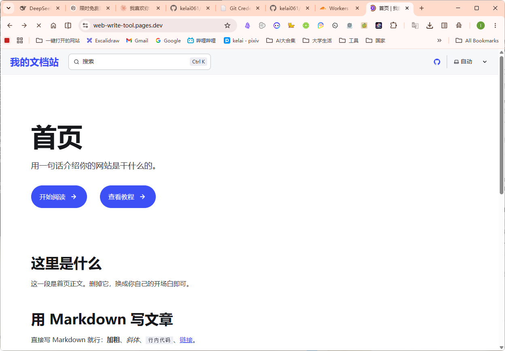
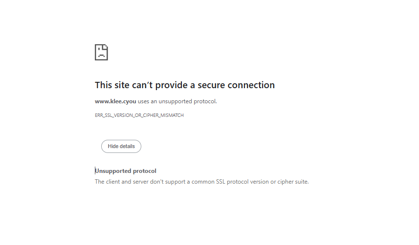

## 页面摘要
- **核心定位**：将 Astro 本地项目托管至 GitHub 并通过 Cloudflare Pages 发布自定义域名的完整手册。
- **重点成果**：记录了新建仓库、Git 推送、Pages 构建环境配置（含环境变量 `NODE_VERSION` 设置）的全套流程。
- **关键看点**：攻克了 DNS 绑定中 Error 1001 错误和 SSL 证书在 Cloudflare 下的免费部署调试经验。

---

## 正文整理
> 原始标题：GitHub 上线托管实现路径

### 第一步：新建 GitHub 仓库
首先登录 GitHub。


*图：新建 GitHub Repository 界面配置*

1. 打开浏览器并访问：**[https://github.com/new](https://github.com/new)**。
2. 在 **Repository name** 输入框中，输入名称，例如：`web-imitation-tool`。
3. 选择 **Public**（公开）。
4. **注意**：下面的 “Add a README file”、“Add .gitignore”、“Choose a license” **都不要勾选**（保持默认未勾选状态即可）。
5. 点击最下方的绿色按钮 **Create repository**。
6. 创建成功后，您会看到一个以 `.git` 结尾的链接，类似这样： `https://github.com/您的用户名/web-imitation-tool.git`。

### 第二步：推送本地代码
在终端中定位到项目目录并运行以下命令，完成推送与授权：


*图：在本地控制台运行命令推送到 GitHub*

```powershell
cd "E:\AI\zcode\object\Web imitation\tool"
git push -u origin main
```

---

### 第三步：关联 Cloudflare Pages 部署
代码已成功更新，并推送到您的 GitHub 仓库：[https://github.com/user_github/web-write-tool](https://github.com/user_github/web-write-tool)。

> [!TIP]
> 已经帮您把 `astro.config.mjs` 中的 `site` 域名配置更新为了 `https://web-write-tool.pages.dev`，这样等部署完成后，您网站的 Sitemap 和搜索引擎优化（SEO）就会自动匹配正确的域名。

现在，您只需要登录 Cloudflare 控制台完成最后的部署：
1. **登录 Cloudflare**： 访问 [https://dash.cloudflare.com](https://dash.cloudflare.com/)（推荐直接使用 **GitHub 一键登录**）。
2. **创建 Pages 应用**：
   - 登录后，在左侧导航栏中点击 **Workers & Pages**。
   - 点击右侧的 **Create application** 按钮。
   - 切换到 **Pages** 选项卡。
   - 点击 **Connect to Git** 按钮。


*图：Cloudflare Workers & Pages 关联 Git 界面*

3. **选择并关联仓库**：
   - 授权后，在列表中选中您的仓库 `web-write-tool`，然后点击 **Begin setup**。
4. **配置构建参数**： 在配置页面中，请确保按照以下参数填写（大部分 Cloudflare 会自动识别，但建议核对）：
   - **Project name**: `web-write-tool`
   - **Production branch**: `main`
   - **Framework preset**: 选择 **Astro**
   - **Build command**: `npm run build`
   - **Build output directory**: `dist`

   **添加环境变量**：
   - 展开页面下方的 **Environment variables (advanced)** 区块。
   - 点击 **Add variable**。
   - **Variable name** 填：`NODE_VERSION`
   - **Value** 填：`24`
5. **部署与上线**：
   - 点击最下方的 **Save and Deploy**。
   - 等待 1~2 分钟，Cloudflare 会自动完成拉取、安装依赖和构建。
   - 构建完成后，您就可以通过 **`https://web-write-tool.pages.dev`** 访问您的专属写作文档站了！
6. **（可选）自定义域名**： 如果您有自己的域名，可以在 Pages 项目的 **Custom domains** 页面中点击 **Set up a custom domain**，输入您的域名，Cloudflare 会自动帮您配置好解析和 SSL 证书。

#### 异常排查一：构建参数与控制台版本差异
如果在导入现有 Git 仓库后没有找到 Framework preset 等选项：


*图：Cloudflare 控制台构建选项*


*图：选择对应 Git 项目构建界面*

请在 **Import an existing Git repository** 右侧点击 **Get started** 按钮，授权您的 GitHub 账号并选中 `web-write-tool` 仓库即可开始配置构建参数！

#### 构建成功提示
配置成功后即可完成自动化编译与发布：


*图：Cloudflare Pages 编译发布成功提示*

---

### 第四步：阿里云自定义域名绑定
为了使用自定义域名 **`www.klee.cyou`** 访问网站，请按照以下步骤配置：

#### 1. 在 Cloudflare 侧发起申请
- 在 Cloudflare Pages 的 **`Custom domains`** 页面，点击 **`Set up a custom domain`**.
- 输入 **`www.klee.cyou`**，然后点击 **Continue**。
- 此时页面会提示您需要添加解析记录。

#### 2. 在阿里云后台添加 CNAME 记录
- 打开并登录 [阿里云控制台](https://console.aliyun.com/)。
- 在顶部搜索框中输入 **云解析 DNS** 并点击进入。
- 在域名列表中找到 **`klee.cyou`**，点击右侧的 **“解析设置”**。
- 点击 **“添加记录”** 按钮，在弹出的窗口中这样填写：
  - **记录类型**：选择 **`CNAME`**
  - **主机记录**：填写 **`www`**
  - **解析线路**：选择 **`默认`**
  - **记录值**：填写 **`web-write-tool.pages.dev`**
  - **TTL**：保持默认（10分钟）即可
- 点击 **“确定”** 保存。

#### 3. 激活并等待解析生效
- 回到 Cloudflare 页面，点击下面的 **Check status** 按钮。
- DNS 解析在全球生效需要一点时间（通常在 1~5 分钟内）。
- 生效后，Cloudflare 会自动为 `www.klee.cyou` 申请 SSL 安全证书。当您看到状态显示为绿色的 **Active** 时，即可用 **`https://www.klee.cyou`** 访问。

> **关于不带 www 的根域名 (`klee.cyou`)**：
> 1. 在 Cloudflare 里重复上面的步骤，把 `klee.cyou`（不带 www）也加进去。
> 2. 在阿里云解析里，再添加一条记录：记录类型为 `CNAME`，主机记录填 `@`，记录值同样填 `web-write-tool.pages.dev`。

---

### 异常排查二：SSL 证书和 DNS 1001 报错

#### 1. 证书签发中报错 `ERR_SSL_VERSION_OR_CIPHER_MISMATCH`


*图：浏览器提示证书不匹配错误*

- **原因**：这代表域名解析已经成功指向了 Cloudflare，但 Cloudflare 还在为您的域名申请和安装 SSL 安全证书。还没有生成好安全证书，浏览器无法建立加密连接。
- **解决**：这是正常现象，通常在添加解析后需要 **5 ~ 15 分钟** 来完成证书的签发和全球部署。
- **安全提醒**：**千万别在阿里云花钱买 SSL 证书**。Cloudflare Pages 会为所有绑定到它上面的自定义域名**免费提供并自动续期 SSL 证书**，无需在阿里云配置任何证书。

#### 2. DNS 错误提示 `Error 1001 DNS resolution error`


*图：Cloudflare 提示 Error 1001 错误*

- **原因**：域名 CNAME 解析已经完全生效（流量已经到达 Cloudflare 的服务器），但 Cloudflare 的服务器在自己的系统里还没有找到这个域名和您的 Pages 项目的绑定关系。
- **解决**：
  1. 确认在 Cloudflare Pages 项目的 **`Custom domains`** 页面中，已经添加了 **`www.klee.cyou`**。
  2. 如果已经添加，查看状态，若是 **`Pending DNS verification`** 或是存在 **`Check status`** 按钮，点击它进行验证刷新。一旦变绿，Error 1001 就会立刻消失。

## 相关资料
- **附件与链接索引**：见 [链接整理/链接索引.md](/ke-she/assets/链接索引/)
- **原始备份**：见 [原始备份_课设内容大分级/github上线托管实现路径.md](/ke-she/03-课设展示网站/原始备份_课设内容大分级/github上线托管实现路径/)