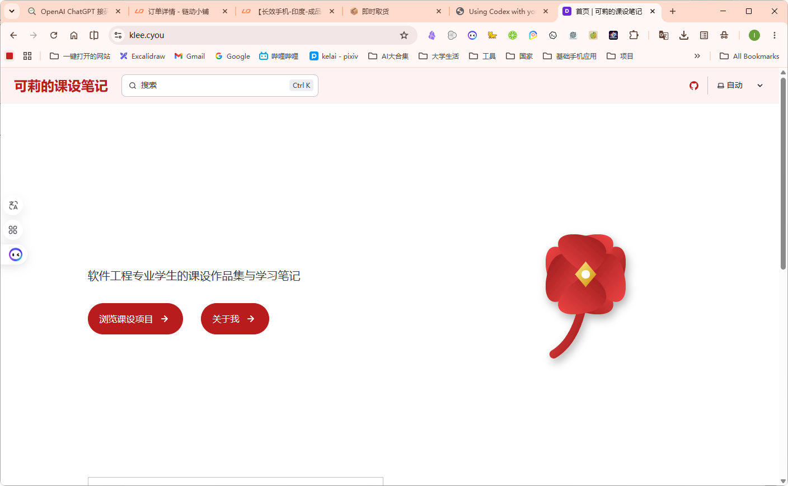

## 页面摘要
- **核心定位**：本站内容迭代与 Git 推送指南。
- **重点成果**：记录了本站前四轮的修改迭代反馈，包含了主题色微调、布局混乱修复、404 死链解决等实战。

---

## 正文整理
> 原始标题：GitHub 推送与课设展示网站迭代

以下记录了展示网站在多次迭代中收集的反馈和修改日志：

### 第一轮
- 调研文件：`"E:\AI\zcode\object\ke-she\上线\README.md"`
- 脑力日志：
  - [第一轮建站计划书](file:///c:/Users/user/.gemini/antigravity/brain/beb8816f-2a2a-4f2c-a762-c9ad16d0b9ac/implementation_plan.md)
  - [第一轮建站工作日志](file:///c:/Users/user/.gemini/antigravity/brain/beb8816f-2a2a-4f2c-a762-c9ad16d0b9ac/walkthrough.md)

### 第二轮：界面与主题重设计
反馈修改：
> https://www.klee.cyou/  
> 重新设计一下界面什么的，红色主题的哦，还有排布，照样的，现在整体看上去非常乱。  
> 照样的调研好修改生成 md 文档，新建专属的文件夹放在里面，MD 文档做好标注，标注原链接这些，以及如果你思考的更深入的话，可以用多 MD 的形式。

- 计划与日志：已针对红色主题及档案馆风格进行界面优化，排版趋于清爽。

### 第三轮：内容缺失与死链检查
针对编译发布后出现的部分内容缺失、写作测试页面多余等问题进行了清理，确保路由全部以小写形式映射。

*图：GitHub 仓库的提交记录与代码热重载*

### 第四轮：内容恢复与链接重整
针对 AI 大规模摘要导致的文字丢失与过密链接问题进行修复，恢复了 12 个文件的完整 Markdown 原文。

## 相关资料
- **附件与链接索引**：见 [链接整理/链接索引.md](/ke-she/assets/链接索引/)
- **原始备份**：见 [原始备份_课设内容大分级/github推送.md](/ke-she/03-课设展示网站/原始备份_课设内容大分级/github推送/)