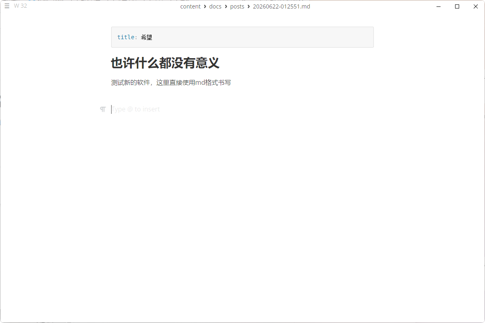

## 页面摘要
- **核心定位**：本归档站的设计、架构与技术调研主线。
- **重点成果**：实现了本地 Markdown 原生文档向现代化 Astro + Starlight 静态展示站的转换，并通过 GitHub 与 Cloudflare Pages 实现了自动化边缘部署发布。
- **关键看点**：Markdown 转换为静态 HTML 结构的效果对比与部署实践。

---

## 正文整理
> 原始标题：课设展示网站项目

### 1. 本地 Markdown 到网页端转换
通过将本地以 Markdown 格式书写的文档和笔记，编译为 Starlight 文档主题，实现了带全文检索和高亮代码的展示系统。

*图：本地 MarkText 编辑器中的 Markdown 原始排版*

*图：转换为 Starlight 网页并在本地应用极简红主题后的效果*

---

## 相关资料
- **建站调研报告**：[调研报告](/ke-she/03-课设展示网站/引用文件/调研报告/)
- **部署上线调研**：[部署上线调研](/ke-she/03-课设展示网站/引用文件/部署上线调研/)
- **项目档案与备份**：[项目档案与备份说明](/ke-she/03-课设展示网站/引用文件/项目档案与备份/)
- **原始备份**：见 [原始备份_课设内容大分级/课设展示网站项目.md](/ke-she/03-课设展示网站/原始备份_课设内容大分级/课设展示网站项目/)