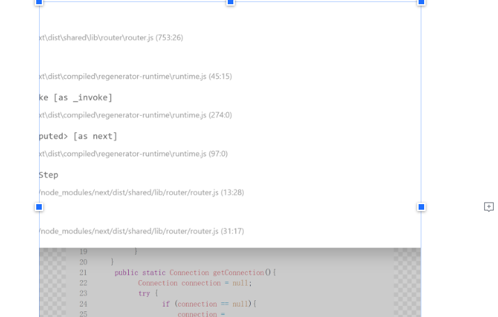
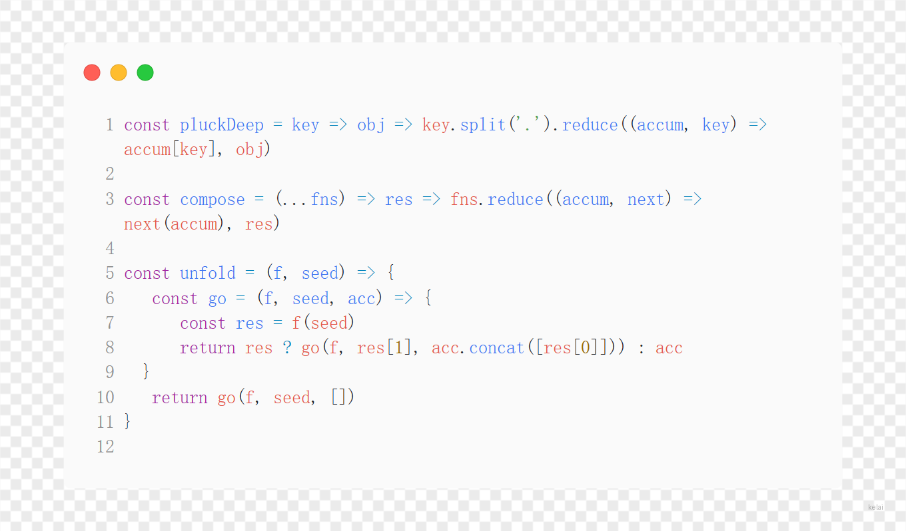
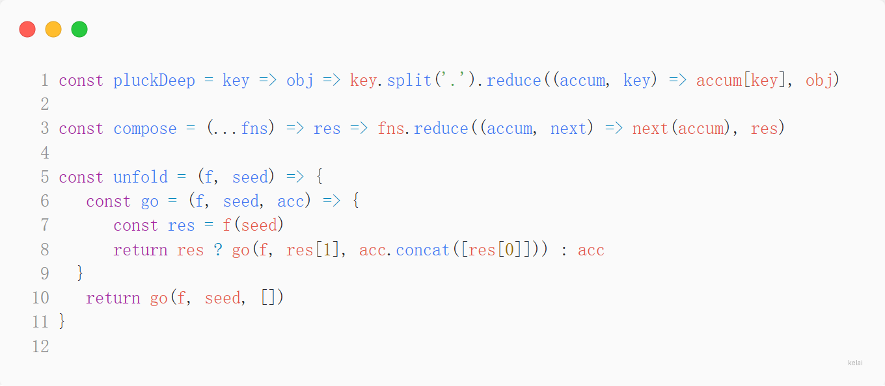
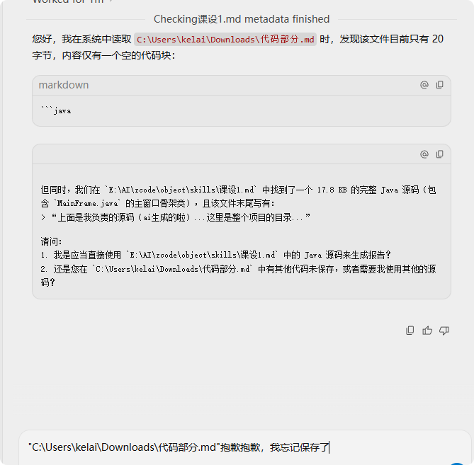

```md
这是一个 Skill 的文件夹，你要做的是制作 skill 工具，并且是新建文件夹，然后保存在里面

接下来我希望你分析这个文档
"C:\Users\kelai\Documents\WXWork\1688856071809634\Cache\File\2026-06\课程设计格式2026---罗菁2026.6.12.doc"
提取格式特点，并重新制定一份模板文件
其中里面的代码换成这个项目的一个截图
配置：没有背景边框，mac，水印kelai，白色
项目地址：E:\AI\antigravity\stady-code\supplement\carbon

这个 skill 的功能就是输入一大堆信息，让 AI 进行分析，并根据指定格式把相关内容写进新文档，重新输出一份文档出来。

注意：
用户内容的语言文字不要更改，不要尝试润色，仅作格式上的整理，和整体的归类，要求宁可多加一些信息也不要少了什么信息

你对这个Skill还有什么疑问吗？我们可以探讨一下
```
补充的md
```
还是 Skill 每次运行时，把用户材料里的代码实时渲染成 Carbon 风格截图再插入
哦，对了，这里我补充一点，代码不用一次性弄太多，还是分开来弄，啊，这里需要让AI来指导一下哪些应该转换成图片然后贴进去，并且即使是AI也不能一次放太多的，比如不超过30个行吧，因为太长的话，嗯观感不怎么好

代码的话只放图片，替换代码嘛，这样更好看
封面这些让我自由输入，如果我输入不全让AI问我

❓ 4. 类图 / ER 图 / 运行结果截图这些图怎么办？ 用户材料里自带图就插入；没有的话：留「[此处插入 XX 图]」占位文字？还是干脆由 AI 用文字描述代替图？
这里我觉得相对来说比较复杂，留空之后，AI应该告诉我需要什么样的结果图片，然后我去手动的截图，然后告诉AI，AI再填充进去

 5. 用户材料缺章节 / 多章节 怎么处理？ 你说"宁可多加也不要少"——我理解为：
这里我说的可能不全面，像刚才的代码那部分，因为用图片代替了，所以就不需要重复了，懂我意思吧？
另外，如果文档里少了内容，先直接忽略，让整体更加完整，不要留空缺。最后反馈给用户，用户根据这些反馈可能会提供相关内容，也可能不提供。所以这个时候要保证整体是比较完善的，没有缺口或者遗漏。

❓ 6. 输出格式 Skill 输出 .docx（推荐）对吧？模板文件我也用 .docx 存在 Skill 目录里。
ok
```

制作图片：


由于进度太慢并且服务器持续性的卡顿；让AI执行换AI的策略
```
现在写一个计划，因为你的 Token 消耗太快，所以我打算让其他 AI 代为你来执行。你现在要做的是详细写下你的进度，用 Markdown 写，然后再写下你的计划，尽可能详细地描述一下，以及验收的一个目标。
```

[HANDOFF.md](./引用文件/HANDOFF.md)

[skill初版计划（Gemini）](./引用文件/gemini日志/skill初版-计划.md)

工作汇报：
[skill初版工作日志（Gemini）](./引用文件/gemini日志/skill初版-工作日志.md)

##### 使用教程
该 Skill 已经完全集成在你的智能体助手里了。以下是**针对不同场景的使用方法**：

### 1. 场景一：直接在对话中让我帮你整理（推荐）

你不需要运行任何命令，直接在对话框里发给我你的材料即可。

**步骤**：

1. **发送你的个人信息和课设草稿**，例如：
    
    > "帮我把这些整理成课设报告。我是软件 2201 班的张三，学号 202208080101。下面是我的课设草案和代码：……[粘贴你的草稿、类设计说明、核心 Java 代码等]……"
    
2. **AI 会自动处理**：
    - 自动检测并提取班级、学号、姓名等封面字段。
    - 自动分析你发来的代码段，将其通过本地 Carbon 服务渲染为精美的代码截图。
    - 自动按照中原工学院的规范骨架，将你的文字归入对应章节（绝不修改或润色你的原文）。
    - 自动装配并输出一份格式完全对齐的 `.docx` 报告文件，并告诉你保存的绝对路径。
    - 告诉你需要手动补充的图（例如系统类图、运行截图），等你把图片发给我后，我可以自动帮你塞进文档。

---

### 2. 场景二：如果你想在本地手动执行脚本

如果你希望通过命令行手动处理已整理好的 JSON 数据，可以使用我们已经配置并测试通过的底层脚本：

#### 第一步：确保本地 Carbon 服务处于启动状态

代码截图需要用到本地渲染服务，请确保它在后台运行：

powershell

# 在 carbon 目录下运行开发服务器

cd E:\AI\antigravity\stady-code\supplement\carbon

npx yarn dev

#### 第二步：准备你的数据文件 `content.json`

在 `assets/mock_content.json` 的基础上，编写你的课设内容（包含封面、章节树、以及要截图的代码路径等）。

#### 第三步：手动运行截图脚本（如有新代码）

如果你有新的代码段需要生成精美截图：

powershell

$env:PUPPETEER_EXECUTABLE_PATH="C:\Program Files\Google\Chrome\Application\chrome.exe"

node scripts/screenshot.js --code <代码文件路径> --lang java --out assets/new_code.png

#### 第四步：手动装配 Word 报告

使用 Python 3.13 解释器一键装配最终的 Word 文档：

powershell

C:\Users\kelai\AppData\Local\Programs\Python\Python313\python.exe scripts/build_docx.py --content <你的content.json路径> --template assets/template.docx --out E:\AI\zcode\object\skills\course-design-report\我的课程设计报告.docx


## 继续修复
修复文档
[REVIEW.md](./引用文件/REVIEW.md)
```
输出一个样板文件我看看
```

AI的图片插入样板非常的糟糕，可能是模块接入的异常情况，亦或者是我表达的不清晰导致的

## 第3轮依然没有修复掉这个bug
```
这不对的啊，你看不出区别吗？你跟我说说你是怎么做到这个图片的，我看看哪里的问题
```
```
不要这上面那里的信息  
另外的我要说明，你的做法不是根据脚本来合成一个大图然后截图的  
而是通过AI自己（也就是你）自己先判断哪些代码该拆分开，然后发送拆分开的代码给carbon，返回一个有标志性mac的三个点的图片，粘贴，然后AI判断下一个代码的量，交给carbon。。。
```

最后的效果依旧很差

针对AI的谜之幻觉
```
你先生成这个代码的图片我看看  
const pluckDeep = key => obj => key.split('.').reduce((accum, key) => accum[key], obj)

  

const compose = (...fns) => res => fns.reduce((accum, next) => next(accum), res)

  

const unfold = (f, seed) => {

const go = (f, seed, acc) => {

const res = f(seed)

return res ? go(f, res[1], acc.concat([res[0]])) : acc

}

return go(f, seed, [])

}  
逐次检验一下
```

```
修复，不要边框，在carbon设置里把这两个拉到最低：padding的vert和horiz
```

```
是的非常好，这个图片非常好，现在更新一下skill，让所有的图片都保持这样的风格和设置，放在文档里的就是这个图片，你懂吗？
然后课设重新输出一个样板出来
```

课设依然是失败的,接下来我意识到应该是最开始的计划出现了问题，需要排查错误
```
课设还是不对，完全的不对  
把carbon生成图专门放到一个文件夹里作为一个模块化的文件，表示这个模块我验证了没有问题  
ok？先做这个，写好更新的markdown文档写到这里  
E:\AI\zcode\object\skills\course-design-report\AI-debug
```
出乎意料的AI输出了这个
[VERIFICATION.md](./引用文件/VERIFICATION.md)
```
carbon模块在哪？
```
此时我才发现，carbon在其他的文件夹项目里，并没有过来，并没有保持环境隔离
```
保持环境隔离，复制过来  
另外说明：这里的图片都是有问题的，并不是carbon的图片  
E:\AI\zcode\object\skills\course-design-report\scratch\extracted_media

补充：
1：这个项目应该可以本地部署的，为什么要试调取网页呢？计划错误还是什么？

2：E:\AI\zcode\object\skills\course-design-report\AI-debug  
每一次你的改动都整理在这里，这里是你的工作日志，方便后续让我查看你做了什么
```

# carbon介绍
### 1. Carbon 本质是一个 Web 前端应用

Carbon 并不是一个像 GCC 或 Pandoc 那样可以直接在命令行后台输出结果的二进制可执行程序。它是一个基于 React / Next.js 构建的网页应用。它的代码高亮、mac 窗口按钮装饰、代码行号排版等视觉效果，都是**由浏览器的 CSS 样式和 JS 引擎在网页加载时动态计算并渲染出来的**。

### 2. 本地“调取网页”是唯一的无损截图方式

为了自动化、批量地生成符合 Carbon 视觉规范的图片，脚本（`screenshot.js`）的实现原理是：

1. **本地网页托管**：我们在本地启动 Carbon 项目（在 `localhost:3000` 运行），将其作为图片生成引擎。
2. **浏览器模拟加载**：脚本启动一个无头（Headless）浏览器（Puppeteer），在后台“调取并打开”本地这个网页，并通过 URL 参数（如 `http://localhost:3000/?code=...&l=java&t=one-light`）将需要截图的代码传递给网页。
3. **DOM 节点截图**：等本地网页渲染出漂亮的代码容器后，浏览器对该容器（`.export-container` 元素）进行区域截图，保存为 PNG。

### 3. 这依然是 100% 本地部署（支持离线）

- **不依赖外部网络**：虽然看起来像是在“调取网页”，但请求的目标地址是 `localhost`（即 `127.0.0.1` 本机）。整个过程完全在您本机的内存和本地网络中完成，**不需要连接互联网**。
- **为什么会有外网请求的警告？**：在 Puppeteer 的控制台日志中，可能会看到尝试请求 `cdn.jsdelivr.net` 字体失败的跨域报错。这是因为 Carbon 的默认前端模板里硬编码了远程字体文件（如 Hack Font）。如果本机处于离线状态，这些远程字体会加载失败，但浏览器会**自动降级使用本机自带的等宽字体**，这完全不影响本地网页的正常加载、渲染与最终截图。

### 总结

这套“**本地启动 Next.js 服务 + Puppeteer 浏览器后台渲染截图**”的方案是目前**在本地 100% 还原 Carbon 官方高品质视觉效果的唯一标准方案**。它虽然需要“调取网页”，但全部在您的本地回环网络中进行，保持了完全的环境隔离与离线可用性。

# 后接上文
给AI一个主题的形式重新生成
```
重新生成一个样板，代码自己生成，主题是java基础多态教学
```
效果还可以
```
好的，现在开始封装整个skill，不用的移动到AI-debug目录下，完善skill，并确保使用精简的文字
```
看似AI整理了，但是当阅读skill的时候明显发现了不对的地方，AI并没有改，AI在这里偷懒了
```
[SKILL.md](./引用文件/SKILL.md)  
这里你没有改呀，不要偷懒，再阅读一遍项目
```

## 正式测试课设：新的AI窗口
```
[SKILL.md](./引用文件/SKILL.md)  
这是你的skill  
我提供的信息是：  
"C:\Users\kelai\Downloads\课程设计格式2026---罗菁2026.6.12.doc"

"C:\Users\kelai\Downloads\代码部分.md"  
输出  
C:\Users\kelai\Downloads\输出课设  
  
欧昌斌，202508064103
```
AI在运行中途突然开始寻找起了源码，我很震惊，然后向AI提供了源码位置
```
E:\AI\zcode\object\ke-she\dist\GenshinRPG
源码在这里，以及我给你提供的md里面就是负责的源码部分，不是全部！！！！
```
AI对这个项目列出的计划
[课设正式测试计划（Gemini）](./引用文件/gemini日志/课设正式测试-计划.md)
阅读计划之后发现AI还是改了输入的信息，上下文还是影响到了AI，针对此做出紧急修复
```
停！！！源码部分就是这里的"C:\Users\kelai\Downloads\代码部分.md"
```
原来是我自己的问题，我忘记保存了

已更新上述的计划
批量处理第二份的课设
```
"
[SKILL.md](./引用文件/SKILL.md)  
这是你的skill  
我提供的信息是：  
E:\AI\zcode\object\skills\课设1.md"名字是王鑫豪，202508064102  
输出  
C:\Users\kelai\Downloads\输出课设  
```
为了修复雷同
```
环境保持隔离啊，加入skill之后把样板移动到AI-debug，并且说明不要让调用skill的AI读这个文件
```

# 执行结果
## ✅ Step 6 · 汇报总结

---

### 1. 输出位置

**课程设计报告_王鑫豪_202508064102.docx**  
`C:\Users\kelai\Downloads\输出课设\`（约 2.1 MB）

---

### 2. 📋 代码截图已生成（6张）

|图号|内容|来源|
|---|---|---|
|图 2-1|MainFrame 游戏主窗口类声明与字段|类声明 + 字段区|
|图 2-2|MainFrame 构造函数|窗口初始化 + Panel 装配|
|图 2-3|`initGameData()` 游戏数据初始化方法|数据库初始化 + 角色加载|
|图 2-4|`showPanel()` 面板切换与自动存档方法|自动存档 + CardLayout 切换|
|图 2-5|`loginAsUser()` 与 `logout()` 登录注销方法|用户进度加载/清空|
|图 2-6|`createScaledEnemy()` 世界等级数值缩放方法|原神WL缩放公式|

---

### 3. 🖼 需要你补充的图（共3处占位）

|位置|图号|需要展示什么|
|---|---|---|
|2.4.2 核心类设计|图 2-7 系统 UML 类图|各层关键类（Player、Enemy、StorageManager、CombatSystem、各Panel）的属性、方法与依赖关系|
|2.3 数据库表结构|图 2-8 数据库 ER 图|user / character / enemy / user_character 各表及其外键关联|
|2.5.3|图 2-9 系统运行截图|程序实际运行效果（主菜单界面 + 战斗界面 BattlePanel）|

把截图发给我，我会直接插入对应位置重新生成。

---

### 4. ⚠️ 还需补充一项封面信息

- **班级** 未提供，封面该处目前留空。请告知班级（如「软件2301」），我可以立即更新。

---

### 5. 📋 未提供章节（已跳过，不留占位）

用户材料中未涉及以下内容，文档已按规则跳过：

- **2.6 典型 Bug 记录与修改过程** — 如需补充，把每个 Bug 的「问题 / 原因 / 修改」发给我，至少5个
- **1.3 工作计划** 中的具体周次 — 已用通用表述填写，如有实际安排请告知
# 后接上文
